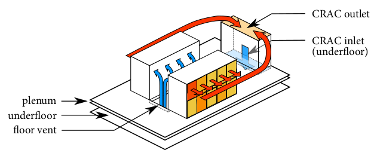
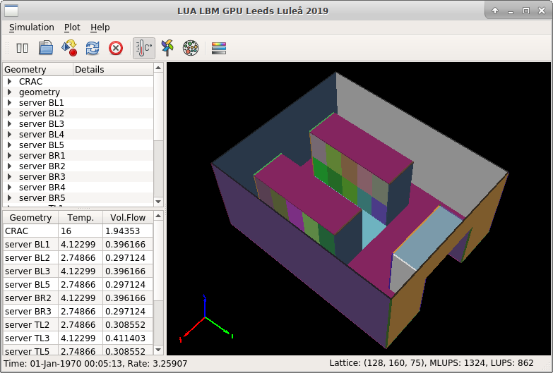
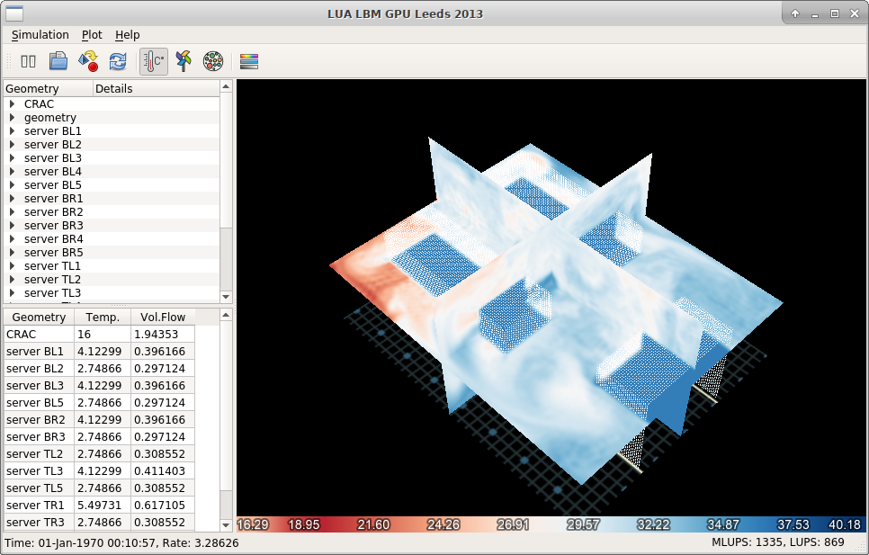

# Rafsine
Rafsine is a [Computational Fluid Dynamics](https://en.wikipedia.org/wiki/Computational_fluid_dynamics) (CFD) program which implements the [Lattice Boltzmann Method](https://en.wikipedia.org/wiki/Lattice_Boltzmann_methods) (LBM) for simulation of indoor air flows in real-time (or faster). 

The program was originally developed by Nicolas Delbosc during three years of Ph.D studies at the School of Mechanical Engineering at the University of Leeds, England. It was studied and documented in his thesis "[Real-Time Simulation of Indoor Air Flow using the Lattice Boltzmann Method on Graphics Processing Unit](http://etheses.whiterose.ac.uk/13546/)".

The Lattice Boltzmann method is based on the concept of [cellular automaton](https://en.wikipedia.org/wiki/Cellular_automaton) and models the evolution of fluid properties on a regular 3D grid (also called a _lattice_). Fluids are represented in the so called mesoscopic level (between micro- and macroscopic) and properties such as temperature and velocity are stored in statistical _distribution functions_. These describe the probability of finding a particle with a specific temperature and velocity at a specific location on the grid.


## Requirements
Rafsine implements LBM on Nvidia Graphical Processing Units (GPU) using [Nvidia CUDA](https://en.wikipedia.org/wiki/CUDA). To be able to run Rafsine, an actual Nvidia GPU needs to be installed.

The simulation domain, consisting of initial- and boundary-conditions, is constructed using scripting in the [Lua language](https://www.lua.org/start.html). The script files can be opened by Rafsine at runtime and loaded into the CUDA kernel. Some knowledge of Lua is therefore required by the user.

## Sample problem
Consider a small [data center](https://en.wikipedia.org/wiki/Data_center). A large Computer Room Air Conditioner (CRAC) draws in hot air from an intake at its topmost position. Cold air is pushed through a hollow floor and ventilated out between the two rows of server racks. The racks take in the cold air in a corridor and pushes out heated air on the other side.



How can we we describe this problem in terms of an LBM simulation? 

First, we have to define some constants. In a file `settings.lua` we first define a `UnitConverter` which can translate between physical units for length and time, into their corresponding lattice units. We also need to specify various physical constants for fluid dynamics calculations.

```lua
package.path = package.path .. ";lua/?.lua"
require "unitConverter"
uc = UnitConverter({
    reference_length_in_meters = 4.8,
    reference_length_in_number_of_nodes = 128,
    reference_speed_in_meters_per_second = 1.0,
    reference_speed_in_lattice_units = 0.1,
    temperature_convertion_factor = 1,
    reference_temperature_physical = 0,
    reference_temperature_LBM = 0
})
-- Size of the lattice
nx = uc:m_to_lu(4.8) + 1
ny = uc:m_to_lu(6.0) + 1
nz = uc:m_to_lu(2.8) + 1
-- Viscosity
nu = uc:Nu_to_lu(1.511e-5)
-- Smagorinsky constant
C = 0.02
-- Thermal diffusivity
nuT = 1.0e-2
-- Prandtl number
Pr = 0.713
-- Turbulent Prandtl number
Pr_t = 0.9
-- Gravity * Thermal expansion
gBetta = uc:gBetta_to_lu(3.0e-6)
-- Initial temperature
Tinit = uc:Temp_to_lu(16 + 5.6216 / 2)
-- Reference temperature
Tref = Tinit
```
Geometry is created in the file `geometry.lua` using the class `VoxelGeometry`. This class has support for adding rectangles and cubes onto the lattice, for defining boundary conditions. For example, creating a new boundary condition for the data center floor vents, with physical dimensions in meters
```lua
package.path = package.path .. ";lua/?.lua"
require "problems/data_center/settings"
require "VoxelGeometry"
vox = VoxelGeometry(nx, ny, nz)
vents = {
  origin = {1.8, 0.6, 0.0},
  x = 1.2,
  y = 3.0
}
vents.V = uc:Q_to_Ulu(CRAC.Q, vents.x * vents.y)
vox:addQuadBC(
{
  origin = vents.origin,
  dir1 = {vents.x, 0, 0},
  dir2 = {0, vents.y, 0},
  typeBC = "inlet",
  normal = {0, 0, 1},
  velocity = {0, 0, vents.V},
  temperature = {
    type_ = "constant",
    value = 16
  },
  mode = "overwrite",
  name = "CRAC"
})
```
Opening the files `geometry.lua` and `settings.lua` in Rafsine generates the problem domain and uploads it to the GPU for simulation.


Visualization of the data center boundary conditions.


Air temperature at a specific point in time. It is also possible to visualize air velocity and density.

# Installation on Ubuntu 18.04 LTS
Install the C++ dependencies
```sh
sudo apt-get install gcc-6 libc6-dev cmake make gdb luajit lua5.2-dev liblua5.1-0-dev luarocks qt5-default qtbase5-dev libboost-all-dev nvidia-driver-390 nvidia-utils-390 nvidia-cuda-dev nvidia-cuda-gdb nvidia-cuda-toolkit libglm-dev
```

Install git version of [OpenSceneGraph](http://www.openscenegraph.org/)
```sh
git clone https://github.com/openscenegraph/OpenSceneGraph.git
cd OpenSceneGraph
cmake -DCMAKE_INSTALL_PREFIX=/usr -DCMAKE_BUILD_TYPE=Release
make -j$(nproc)
make install
```
By default, the library is installed into `/usr/lib64`, and this path needs to be added to the global library linking path
```sh
echo "export LD_LIBRARY_PATH=$LD_LIBRARY_PATH:/usr/lib64" >> ~/.bashrc
source ~/.bashrc
```
Install the Lua dependencies
```sh
sudo luarocks install multikey penlight
```
Fetch and install Rafsine
```sh
git clone https://github.com/jsjolund/rafsine-gui.git
cd rafsine-gui
cmake -H. -Bcmake-build -G "Unix Makefiles"
cd cmake-build
make -j$(nproc)
./rafsine
```

This will start the Rafsine program. To load a simulation, go to the menu Simulation->Open Script, navigate to a Lua script folder e.g. `problems/data_center`. Click on Choose to load the scripts in the folder (do not mark any file).

# Generate documentation
Rafsine uses the Doxygen tool for code documentation
```sh
sudo apt-get install doxygen graphwiz dia mscgen
cd cmake-build
make doc
```
Open the HTML documentation at `docs/html/index.html` in a web browser, or install LaTeX then generate a PDF from the sources in `docs/latex`.

# Remote visualization through VNC with VirtualGL

## VirtualGL
To run Rafsine on a remote GPU equipped headless server, either [Virtual Network Computing](https://en.wikipedia.org/wiki/Virtual_Network_Computing) (VNC) or X11-forwarding thoguh SSH can be used. For streaming of the OpenGL based visualizations in Rafsine from the server to a local workstation or laptop, a toolkit called [VirtualGL](https://www.virtualgl.org/)  is needed. It allows OpenGL graphics rendering to be done server-side, as opposed to client-side.

VirtualGL needs a graphical environment such as Xfce installed on the server, along with a display manager.
```sh
sudo apt-get install xubuntu-desktop xorg lightdm lightdm-gtk-greeter 
```
This will install various system power management features which are not desired to have on a remote server. To disable them type:
```sh
sudo systemctl mask sleep.target suspend.target hibernate.target hybrid-sleep.target
```
Install the VirtualGL package
```sh
wget -O virtualgl.deb https://downloads.sourceforge.net/project/virtualgl/2.6/virtualgl_2.6_amd64.deb
sudo dpkg -i virtualgl.deb
```
Add the executables to the `$PATH` variable
```sh
echo "export PATH=\$PATH:/opt/TurboVNC/bin:/opt/VirtualGL/bin" >> ~/.bashrc
source ~/.bashrc
```
Follow a guide on how to configure VirtualGL, such as [this](http://theterminallife.com/virtualgl-on-centos-7-using-nvidia-tesla-gpus/). In essence, this is what has to be done, although the `xorg.conf` file must be configured for the conditions on the server.
```sh
wget https://gist.githubusercontent.com/jsjolund/c783b011e2ea2abee6a8c91de056f3c5/raw/3f14be12fcf6d3a9fa14ea1aa9e054bb988697c7/xorg.conf
sudo mv -f xorg.conf /etc/X11/xorg.conf
sudo systemctl stop lightdm
sudo modprobe -rf nvidia_drm nvidia_modeset nvidia_uvm nvidia
sudo vglserver_config -config -s -f -t
sudo usermod -aG vglusers ubuntu
sudo modprobe nvidia_drm nvidia_modeset nvidia_uvm nvidia
sudo bash -c "echo blacklist nouveau > /etc/modprobe.d/blacklist-nvidia-nouveau.conf"
sudo bash -c "echo options nouveau modeset=0 >> /etc/modprobe.d/blacklist-nvidia-nouveau.conf"
sudo update-initramfs -u
sudo systemctl set-default graphical.target
sudo reboot
```

## TurboVNC
```sh
wget -O turbovnc.deb https://sourceforge.net/projects/turbovnc/files/2.2/turbovnc_2.2_amd64.deb/download
sudo dpkg -i turbovnc.deb
```
Start a VNC server on (virtual) DISPLAY 1, and run an Xfce desktop session.
```sh
vncserver -geometry 1920x1200 -localhost -3dwm -nohttpd -securitytypes tlsnone,x509none,none
vglrun xfce4-session --display=:1 --screen=0
```
To create a secure VNC connection to the remote server, create an SSH tunnel by a command such as
```sh
ssh -x -e none -L 5901:127.0.0.1:5901 -p 31761 ubuntu@109.225.89.161 -i ~/.ssh/my_rsa_key
```
Connect to display `localhost:1` on your local machine using the TurboVNC client.

# Keyboard/mouse commands
|Mouse button|Description|
|-|-|
|Left click+drag|Rotate camera|
|Middle click+drag|Pan camera|
|Scroll wheel|Zoom in/out|
|Right click+drag|Also zoom in/out|

|Key|Description|
|-|-|
|F1|Display slices|
|F2|Display geometry|
|F5|Restart simulation|
|A|Adjust slice colors min/max|
|V|Show velocity|
|D|Show density|
|T|Show temperature|
|Space|Pause simulation|
|Insert|Slice X up|
|Delete|Slice X down|
|Home|Slice Y up|
|End|Slice Y down|
|Page Up|Slice Z up|
|Page Down|Slice Z down|
