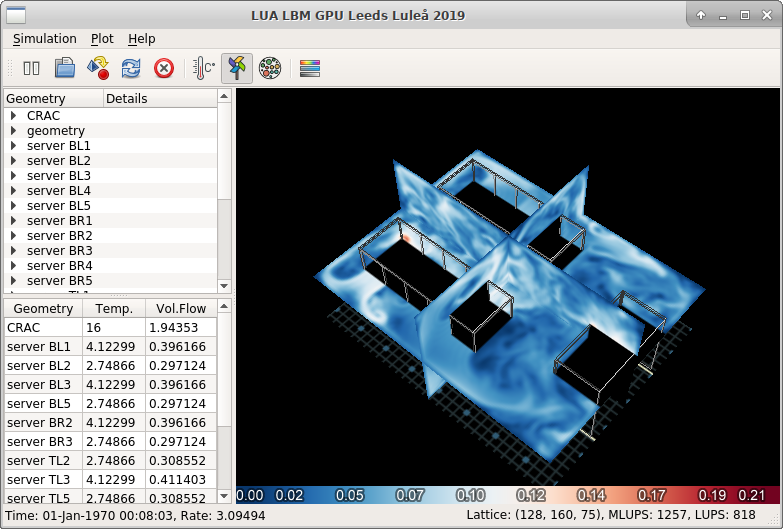

# Rafsine
Rafsine is a [Computational Fluid Dynamics](https://en.wikipedia.org/wiki/Computational_fluid_dynamics) (CFD) program which implements the [Lattice Boltzmann Method](https://en.wikipedia.org/wiki/Lattice_Boltzmann_methods) (LBM) for simulation of indoor air flows in real-time (or faster). 

The program was originally developed by Nicolas Delbosc during three years of Ph.D studies at the School of Mechanical Engineering at the University of Leeds, England. It was studied and documented in his thesis "[Real-Time Simulation of Indoor Air Flow using the Lattice Boltzmann Method on Graphics Processing Unit](http://etheses.whiterose.ac.uk/13546/)".

The Lattice Boltzmann method is based on the concept of [cellular automaton](https://en.wikipedia.org/wiki/Cellular_automaton) and models the evolution of fluid properties on a regular 3D grid (also called a _lattice_). Fluids are represented in the so called mesoscopic level (between micro- and macroscopic) and properties such as temperature and velocity are stored in statistical _distribution functions_. These describe the probability of finding a particle with a specific temperature and velocity at a specific location on the grid.

Rafsine implements LBM on Nvidia Graphical Processing Units (GPU) using [Nvidia CUDA](https://en.wikipedia.org/wiki/CUDA). The simulation domain, consisting of initial- and boundary-conditions is constructed using scripting in the [Lua language](https://www.lua.org/start.html).


Visualization of boundary conditions in a small data center.


Air temperature at a specific point in time.


Air velocity at a specific point in time.

# Installation on Ubuntu 18.04 LTS
## Install the C++ dependencies
```
sudo apt-get install gcc-6 cmake gdb luajit lua5.2-dev liblua5.1-0-dev luarocks qt5-default qtbase5-dev libboost-all-dev nvidia-driver-390 nvidia-utils-390 nvidia-cuda-dev nvidia-cuda-gdb nvidia-cuda-toolkit
```

### Install git version of OpenSceneGraph
```
git clone https://github.com/openscenegraph/OpenSceneGraph.git
cd OpenSceneGraph
cmake -DCMAKE_INSTALL_PREFIX=/usr -DCMAKE_BUILD_TYPE=Release
make -j$(nproc)
make install
```
By default, the library is installed into `/usr/lib64`, and this path needs to be added to the global library linking path
```
echo "export LD_LIBRARY_PATH=$LD_LIBRARY_PATH:/usr/lib64" >> ~/.bashrc
source ~/.bashrc
```

### Install the Lua dependencies
```
sudo luarocks install multikey penlight
```

### Get Rafsine
```
git clone https://github.com/jsjolund/rafsine-gui.git
cd rafsine-gui
git submodule update --init --recursive
```

*TODO:* cmake build steps

# Remote visualization through VirtualGL
```
sudo apt-get install xubuntu-desktop geany lightdm lightdm-gtk-greeter xorg
```

### Disable system sleep
```
sudo systemctl mask sleep.target suspend.target hibernate.target hybrid-sleep.target
```

### TurboVNC
```
wget -O turbovnc.deb https://sourceforge.net/projects/turbovnc/files/2.1.90%20%282.2beta1%29/turbovnc_2.1.90_amd64.deb/download
sudo dpkg -i turbovnc.deb
```

### VirtualGL
```
wget -O virtualgl.deb https://downloads.sourceforge.net/project/virtualgl/2.6/virtualgl_2.6_amd64.deb
sudo dpkg -i virtualgl.deb
echo "export PATH=\$PATH:/opt/TurboVNC/bin:/opt/VirtualGL/bin" >> ~/.bashrc
echo "export TVNC_WM='vglrun xfce4-session --display=:1 --screen=0'" >> ~/.bashrc
echo "export LD_LIBRARY_PATH=$LD_LIBRARY_PATH:/usr/lib64" >> ~/.bashrc
source ~/.bashrc
```


